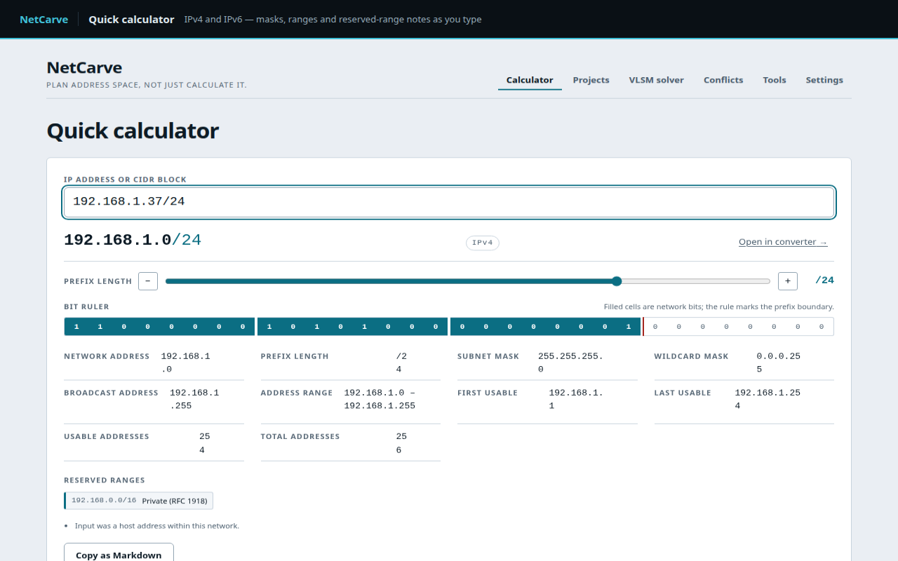
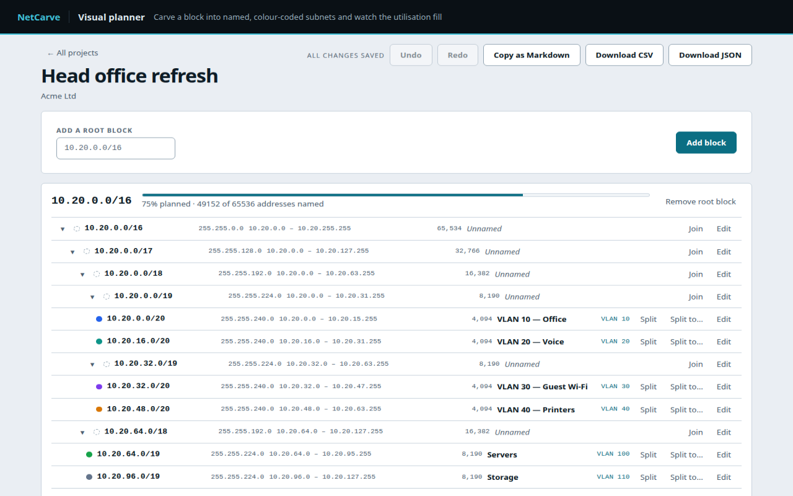
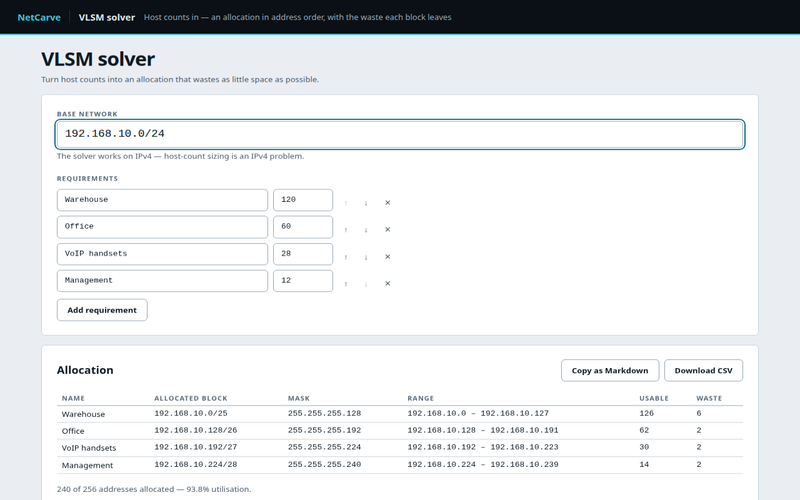
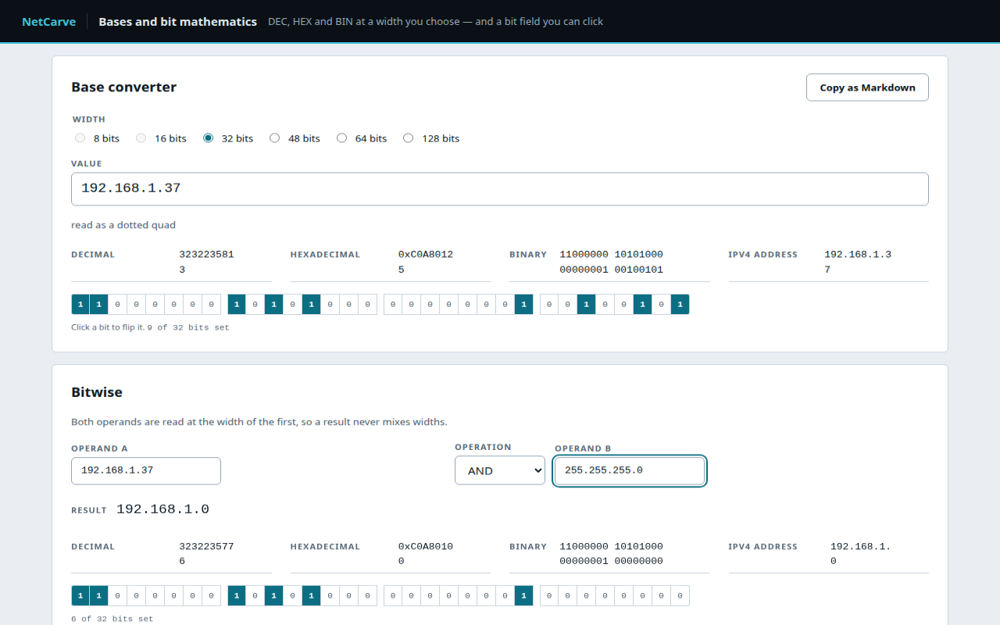
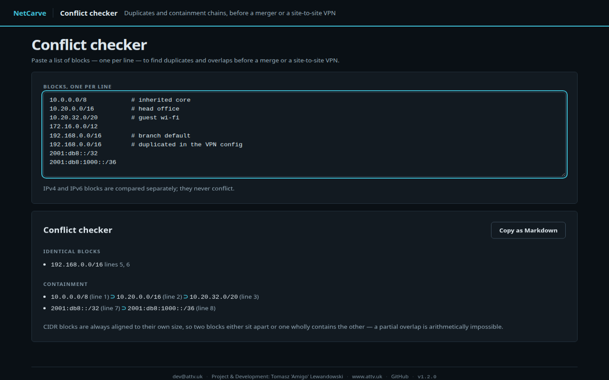
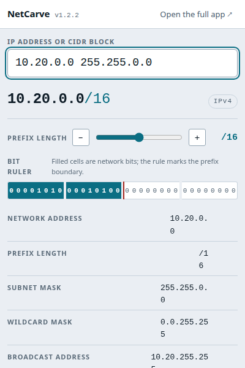

<div align="center">


# NetCarve

**Plan address space, not just calculate it.**

An IP subnet calculator, visual address planner and VLSM solver for Chrome —
running entirely on your own machine.

</div>

---

## What it does

| Feature | Where |
|---|---|
| **Quick calculator** — IPv4 and IPv6, masks, ranges, usable counts, binary/hextet breakdown | Toolbar popup and `#/calc` |
| **Visual planner** — persistent projects, split/join a block tree, named and colour-coded subnets, VLAN IDs | `#/planner/:projectId` |
| **VLSM solver** — turn host-count requirements into an optimal allocation | `#/vlsm` |
| **Conflict checker** — paste a list of CIDRs, find duplicates and containment | `#/conflicts` |
| **Tools** — DEC/HEX/BIN converter with a clickable bit field, bitwise operations, mask ↔ prefix | `#/tools` |
| **Context menu** — select an IP or CIDR on any page and analyse it | Right-click → *Analyse "…" in NetCarve* |
| **Export** — Markdown, plain text, CSV and JSON, ready for client documentation | Everywhere |

## Install it

NetCarve is not on the Chrome Web Store yet. Grab
`netcarve-<version>-chrome.zip` from the
[latest release](https://github.com/AmigoUK/Netcarve/releases/latest), unzip it, then in Chrome
open `chrome://extensions`, turn on **Developer mode** and press **Load unpacked** on the
unzipped folder.

Step-by-step instructions, including Edge and how to update an existing install, are in
[`docs/install.md`](docs/install.md).

## What it looks like

| | |
|---|---|
|  |  |
| **Quick calculator** — masks, ranges and reserved-range notes as you type | **Visual planner** — named, colour-coded subnets with the utilisation bar |
|  |  |
| **VLSM solver** — host counts in, an allocation with the waste out | **Tools** — DEC/HEX/BIN at a width you choose, and a clickable bit field |
|  |  |
| **Conflict checker**, in the dark theme — duplicates and containment | **The popup**, at its real size |

More in [`docs/store/gallery/`](docs/store/gallery) — IPv6, the projects list, the planner and
tools in the dark theme, and settings. Everything under `docs/store/` is generated by
`npm run screenshots`, so it always matches the version it was built from.

## Privacy

NetCarve requests exactly two permissions — `storage` and `contextMenus` — and makes **no network
requests at all**. There is no backend, no analytics, no remote fonts. Every calculation happens in
your browser and every project stays in `chrome.storage.local`.

## Development

```bash
npm install         # install dependencies (also runs `wxt prepare`)
npm run dev         # launch Chrome with the extension loaded, hot reload
npm run build       # production build into .output/chrome-mv3
npm run zip         # store-ready archive
npm test            # unit and component tests (Vitest)
npm run coverage    # coverage; src/lib/ip must stay at 100 % branches
npm run typecheck   # tsc --noEmit
npm run test:e2e    # end-to-end suite against the real build (Playwright + Chrome)
npm run preview     # render every view, light and dark, into .output/preview
npm run screenshots # regenerate the Chrome Web Store assets in docs/store/
npm run ci          # wait for CI on the current commit and report what it did
```

### Looking at the pixels

Three layout defects reached a release before anyone looked at a render: a bit ruler overflowing
the 400 px popup, a link wrapping across three lines beside it, and a value row stretched across
a grid meant for four. None of them showed up in the DOM tests, which assert what the markup
*says* rather than what it *measures* — and none would have been caught by comparing screenshots
against a baseline either, since all three were wrong from their first commit and the baseline
would have enshrined them.

So there are two nets, and they catch different things:

- **`tests/e2e/layout.spec.ts`** measures. Nothing may overflow its container, across every
  route, both themes and three window widths; in the popup, pinned at 400 px, even a
  deliberately scrollable container has to fit. It names the offending element when it fails.
- **`npm run preview`** renders every view in both themes so you can look. Overflow is
  mechanical; *ugly* is not, and the only thing that catches ugly is an eye. **Run it, and open
  the renders, before calling any UI change done.**

The end-to-end suite runs headless — Chromium's new headless mode loads unpacked extensions,
so no display server is involved. To watch a run in a real window while debugging:

```bash
npm run test:e2e:headed
```

Load the unpacked extension from `.output/chrome-mv3` via `chrome://extensions` → *Load unpacked*.

### Quality gates

| Gate | Where | Status |
|---|---|---|
| 100 % branch coverage of `src/lib/ip` | `vitest.config.ts` thresholds, enforced in CI | enforced |
| Manifest permissions limited to `storage` + `contextMenus` | `tests/e2e/extension.spec.ts` | enforced |
| No network call anywhere in the shipped bundle | `tests/e2e/privacy.spec.ts` — static scan plus a live request monitor across every view | enforced |
| No WCAG 2.1 A/AA violations | `tests/e2e/a11y.spec.ts` — axe-core on every route, both themes and the popup | enforced |
| Bundle under 150 KB gzipped | `tests/e2e/privacy.spec.ts` | enforced (~44 KB) |

### Releasing

```bash
node scripts/release.mjs <version> "<summary>" <notes-file>
```

Bumps `package.json`, folds the notes into `CHANGELOG.md`, builds the installable archive,
commits and pushes — then **waits for CI on that commit, and only tags and publishes if it is
green**. Two releases went out red before this gate existed, and the failure was real: a layout
that fitted its container exactly on the machine that built it and overflowed on CI's fonts.
"Green on my machine" is a different claim from "green".

If CI fails the commit stays on `main` untagged; fix it and run the same command again with the
same version. `--skip-ci` is there for a repository without a workflow.

## Documentation

- [`docs/spec.md`](docs/spec.md) — the product specification this implementation follows
- [`docs/superpowers/plans/2026-08-19-netcarve.md`](docs/superpowers/plans/2026-08-19-netcarve.md) — the implementation plan
- [`DECISIONS.md`](DECISIONS.md) — engineering decisions and resolved open questions
- [`CHANGELOG.md`](CHANGELOG.md) — release history
- [`docs/install.md`](docs/install.md) — installing a release without a toolchain
- [`docs/qa.md`](docs/qa.md) — manual QA checklist
- [`docs/store-listing.md`](docs/store-listing.md) — the Chrome Web Store submission sheet, with
  every field ready to paste and the asset checklist

## Credits

dev@attv.uk · Project & Development: Tomasz 'Amigo' Lewandowski · [www.attv.uk](https://www.attv.uk) ·
[GitHub](https://github.com/AmigoUK/Netcarve)

MIT licensed.
